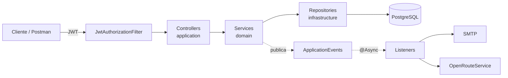
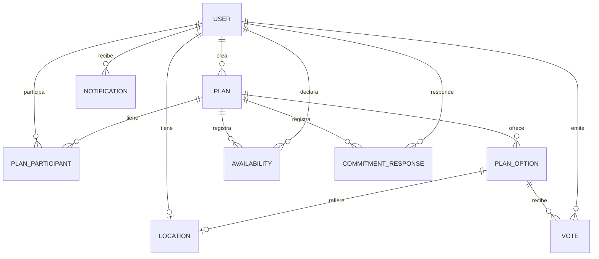

# QSale — Coordinación inteligente de planes grupales

**Curso:** CS 2031 Desarrollo Basado en Plataforma — 2026-2

**Integrantes:** Gonzalo Gaviño · Mathias Pariona · Adriano Raffo

**Deploy:** [qsale-api.onrender.com](https://qsale-api.onrender.com) · **Health:** [`/actuator/health`](https://qsale-api.onrender.com/actuator/health) · **Swagger:** [Swagger UI](https://qsale-api.onrender.com/swagger-ui.html) · **Postman:** [`postman_collection.json`](postman_collection.json)

---

## Índice

1. [Introducción](#1-introducción)
2. [Identificación del problema](#2-identificación-del-problema)
3. [Descripción de la solución](#3-descripción-de-la-solución)
4. [Modelo de entidades](#4-modelo-de-entidades)
5. [Manejo de errores](#5-manejo-de-errores)
6. [Medidas de seguridad](#6-medidas-de-seguridad)
7. [Eventos y asincronía](#7-eventos-y-asincronía)
8. [GitHub & Management](#8-github--management)
9. [Ejecución local](#9-ejecución-local)
10. [Conclusión](#10-conclusión)
11. [Apéndices](#11-apéndices)

---

## 1. Introducción

**Contexto.** Organizar una salida en grupo (una cena, un viaje, un cumpleaños) casi siempre ocurre en chats de WhatsApp mezclados con enlaces de mapas. Quién va, qué día le sirve a cada uno, dónde reunirse y cuánto gastar quedan dispersos entre mensajes y respuestas ambiguas como "creo que sí".

**Objetivos.**
- Centralizar en una API REST la creación de planes, las invitaciones y las respuestas de los participantes.
- Registrar disponibilidad, proponer y votar fechas y lugares.
- Comparar lugares según la distancia real del grupo usando un servicio de mapas.
- Medir la viabilidad del plan con un semáforo y avisar automáticamente cuando puede cerrarse.

## 2. Identificación del problema

**Descripción.** El organizador de un plan grupal no tiene una fuente única de verdad: insiste para obtener respuestas y decide sin saber qué opción le conviene a la mayoría ni quién está realmente comprometido.

**Justificación.** Es un problema cotidiano de cualquier grupo. Reducir la fricción de coordinar evita planes que nunca se concretan, y hacer explícitos el compromiso y la cercanía permite decisiones más justas.

## 3. Descripción de la solución

### Funcionalidades implementadas

| Funcionalidad | Cómo resuelve el problema |
|---|---|
| Registro y login con JWT | Cada participante tiene identidad propia |
| Planes con código de invitación | Tipo, presupuesto, mínimo de participantes y fechas tentativas, compartidos con un código |
| Invitaciones por email | El invitado recibe notificación y correo |
| Alternativas y votos | Fechas o lugares propuestos por el grupo, ordenados por puntaje |
| Disponibilidad | Días y horarios en que cada uno puede asistir |
| Nivel de compromiso | Confirmado, Me interesa o No puedo, en vez de respuestas ambiguas |
| Comparación geográfica | Distancia y tiempo promedio del grupo a cada lugar |
| Semáforo de viabilidad | Índice 0–100: `NOT_VIABLE`, `TO_BE_DEFINED` o `READY_TO_CLOSE` |
| Cierre del plan | Solo con semáforo en verde; fija la fecha y el lugar más votados |
| Notificaciones y correos | Invitación, cambios, mínimo alcanzado, cierre o cancelación |

### Tecnologías utilizadas

- **Lenguaje y framework:** Java 21, Spring Boot 4.1 (Web MVC, Data JPA / Hibernate 7, Security, Validation, Mail, Thymeleaf, Actuator).
- **Base de datos:** PostgreSQL 16 (Docker en local).
- **Seguridad:** JWT con jjwt 0.12, BCrypt.
- **Mapeo:** ModelMapper.
- **API externa:** [OpenRouteService Matrix API](https://openrouteservice.org/) para distancias y tiempos de traslado, con respaldo por fórmula de Haversine.
- **Correo:** JavaMailSender + plantillas Thymeleaf; Mailpit como servidor SMTP de desarrollo.
- **Documentación:** Springdoc OpenAPI (Swagger UI) y colección de Postman.
- **Testing y CI:** JUnit 5, Mockito, Testcontainers, GitHub Actions.
- **Otros:** Lombok, Docker.

### Arquitectura

Los controladores reciben y validan solicitudes HTTP; los servicios concentran reglas y permisos; los repositorios encapsulan persistencia. Se usan DTO separados para entrada y salida, de modo que contraseñas y relaciones JPA internas no se publican. Flyway aplica `V1__initial_schema.sql` y Hibernate valida la correspondencia con las entidades. `@Version` en planes y opciones permite detectar modificaciones concurrentes.

## 4. Modelo de entidades

`User` guarda identidad, rol y ubicación opcional. `Plan` mantiene el presupuesto, mínimo de asistentes, fechas, código de invitación, estado y semáforo. `PlanParticipant` relaciona usuarios con planes y diferencia organizador, invitado y miembro unido. `PlanOption` contiene fechas o lugares propuestos; un lugar se asocia a `Location`, que guarda dirección y coordenadas. `Vote`, `Availability` y `CommitmentResponse` registran las decisiones individuales. `Notification` persiste avisos, fecha de lectura y estado de envío. La base incluye unicidad de email, código de invitación, voto por usuario/opción y compromiso por usuario/plan; las claves foráneas e índices sostienen integridad y consultas frecuentes. Los DTO y Bean Validation restringen rangos, longitud y formato antes de guardar.

## 5. Manejo de errores

`GlobalExceptionHandler` transforma las excepciones del dominio en respuestas HTTP consistentes con marca temporal, estado, tipo, mensaje y ruta. Se distinguen entradas inválidas (`400`), autenticación ausente (`401`), acceso denegado (`403`), recurso inexistente (`404`) y conflictos (`409`). También se manejan validaciones de `@Valid`, JSON mal formado y errores inesperados (`500`). El filtro de seguridad usa su propio manejador para responder antes de entrar al controlador. Por ejemplo, un participante ajeno al plan recibe `403` incluso si conoce su identificador, y un voto repetido no se guarda dos veces. Un fallo de OpenRouteService no elimina el plan: activa el cálculo aproximado.

## 6. Medidas de seguridad

Spring Security usa sesiones `STATELESS`, JWT en `Authorization: Bearer` y BCrypt para las contraseñas. El login emite tokens de acceso y refresh; el filtro verifica firma, vencimiento y tipo, y carga al usuario desde la base. La clave `JWT_SECRET` se obtiene del entorno. Registro, login, Swagger y salud son públicos; el resto requiere autenticación. Los endpoints `/api/v1/admin/**` exigen rol `ADMIN`. `PlanAccessService` aplica membresía y rol de organizador dentro de los servicios, no solo en la URL. CORS permite únicamente los orígenes configurados en `CORS_ALLOWED_ORIGINS` y CSRF está desactivado para esta API sin cookies de sesión.

Las consultas JPA parametrizadas evitan concatenar SQL de entrada del cliente, los DTO no exponen hashes de contraseña y las validaciones rechazan datos inconsistentes. Ninguna credencial de producción debe quedar en Git, capturas, Postman ni logs. Si una contraseña o clave se comparte por error, hay que revocarla o rotarla en el proveedor y actualizar el servicio; cambiar un archivo local no invalida la credencial anterior.

## 7. Eventos y asincronía

El registro, las invitaciones, los cambios de plan, los votos y las respuestas publican eventos. Los listeners recalculan la viabilidad, crean notificaciones y preparan correos; `@EnableAsync` y un `ThreadPoolTaskExecutor` desacoplan las operaciones externas del tiempo de respuesta HTTP. Hay plantillas Thymeleaf para bienvenida, invitación, plan listo y cierre. Las notificaciones se pueden listar y marcar como leídas, y un fallo del proveedor de correo queda registrado como estado `FAILED` cuando se intenta enviar el aviso.

En desarrollo, JavaMailSender usa Mailpit en `localhost:1025`; su bandeja está en `http://localhost:8025`. Render gratuito bloquea los puertos SMTP habituales, por lo que producción envía por la API HTTPS de Resend si se configuran `RESEND_API_KEY` y `MAIL_FROM`. Con el dominio de prueba `onboarding@resend.dev`, Resend limita el envío a la dirección autorizada en su cuenta; para enviar invitaciones a cualquier usuario se necesita verificar un dominio propio. Sin esa configuración, los emails externos **no están operativos**, aunque la API y las notificaciones internas sigan funcionando. Una respuesta aceptada por la API del proveedor tampoco prueba entrega final: se debe verificar un email recibido.

## 8. GitHub & Management

El equipo usa ramas para cambios de funcionalidades y correcciones, pull requests para integrar a `main` y commits descriptivos. La acción en `.github/workflows/ci.yml` se ejecuta en PRs y pushes a `main`, prepara Java 21 y corre `mvn -B clean verify`; eso evita fusionar cambios que rompen compilación o pruebas. La evidencia de revisiones, asignación de tareas, fechas y milestones debe quedar registrada en GitHub Issues/Projects: un README no sustituye esa actividad ni permite atribuirla si no existe. Las claves de servicios externos se mantienen en variables de entorno de Render y no en las ramas.

## 9. Ejecución local

Se necesitan Java 21, Maven y Docker. Desde la raíz del repositorio, ejecutar `docker compose up -d`, configurar un `JWT_SECRET` aleatorio de al menos 32 caracteres y lanzar `./mvnw spring-boot:run` (en Windows, `.\mvnw.cmd spring-boot:run`). PostgreSQL queda en el puerto 5433, Mailpit en 8025 y la API en 8080. La primera ejecución aplica Flyway; no usar `ddl-auto=create` en bases compartidas. Comprobar `GET /actuator/health` y abrir `/swagger-ui.html`.

Las variables de entorno principales son:

| Variable | Obligatoria | Uso |
|---|---:|---|
| `JWT_SECRET` | Sí | Firma de tokens JWT; usar una cadena aleatoria de al menos 32 caracteres. |
| `DATABASE_URL` | Render | Conexión PostgreSQL proporcionada por Render. |
| `DB_HOST`, `DB_PORT`, `DB_NAME`, `DB_USER`, `DB_PASSWORD` | Local | Conexión local; Docker Compose usa PostgreSQL en el puerto 5433. |
| `MAPS_API_KEY` | Opcional | Clave de OpenRouteService para rutas y tiempos reales; sin ella se usa Haversine. |
| `RESEND_API_KEY` | Opcional | Clave de Resend para enviar correo por HTTPS en Render. |
| `MAIL_FROM` | Recomendada | Remitente verificado, por ejemplo `QSale <onboarding@resend.dev>`. |
| `CORS_ALLOWED_ORIGINS` | Opcional | Orígenes permitidos por CORS, separados por comas. |

Las claves de Resend y OpenRouteService se generan en sus respectivos paneles y se copian únicamente en el apartado **Environment** de Render. No se incluyen valores reales en `render.yaml`, Postman, capturas ni commits.

La colección Postman contiene un flujo completo de registro, planes, invitaciones, opciones, votos, disponibilidad, compromisos, cierre y errores. Configurar la variable `hostUrl` como `http://localhost:8080` o `https://qsale-api.onrender.com` antes de ejecutarla. Los grupos de endpoints están bajo `/api/v1`: `/auth`, `/users`, `/admin/users`, `/plans`, `/options` y `/notifications`. Dentro de cada plan se consultan participantes, opciones, disponibilidades, compromisos, viabilidad y `GET /plans/{id}/geography`. Este último devuelve el punto medio esférico y la cobertura de ubicaciones; con menos de dos usuarios unidos y ubicados, `midpoint` es `null` para no revelar una ubicación individual. Las estimaciones por alternativa se consultan en `/plans/{id}/options`.

Render construye el `Dockerfile`, asigna `PORT`, conecta `DATABASE_URL` a PostgreSQL y genera `JWT_SECRET` con `render.yaml`. Después de crear una clave nueva de OpenRouteService, se agrega como `MAPS_API_KEY`; sin ella se usa Haversine a 25 km/h, que **no es tiempo de tráfico real**. La propuesta mencionaba Google Maps, pero el backend emplea OpenRouteService como equivalente. Después de crear una clave nueva de Resend, se agrega como `RESEND_API_KEY` junto con `MAIL_FROM=QSale <onboarding@resend.dev>`; el dominio de prueba solo sirve para la dirección autorizada por Resend. Tras guardar variables, redeplegar y comprobar health, login, creación de plan, estimación y mensaje recibido. La base gratuita de Render vence tras 30 días y no incluye backups; exportar los datos o migrarla antes del vencimiento.

## 10. Conclusión

**Logros.** QSale centraliza decisiones antes dispersas y permite cerrar un plan solo con compromiso y viabilidad suficientes. La solución combina reglas de negocio, transacciones, permisos por plan, eventos y servicios externos sin convertir cada fallo de correo o mapas en una caída del flujo principal.

**Aprendizajes clave.** El equipo aprendió a separar controladores, servicios y persistencia, proteger recursos por membresía y coordinar tareas externas con eventos asíncronos. También comprobó que una integración externa necesita un respaldo explícito y configuración segura.

**Trabajo futuro.** Las estimaciones aproximadas no sustituyen rutas reales con tráfico. Quedan como mejoras la observabilidad, reintentos de proveedores, respaldos duraderos y una interfaz web que consuma la API; esta entrega se centra en el backend.

## 11. Apéndices

- [Colección Postman](postman_collection.json): solicitudes, ejemplos y variables de prueba.
- [Migración inicial](src/main/resources/db/migration/V1__initial_schema.sql): tablas, restricciones e índices.
- [CI](.github/workflows/ci.yml): validación automática con Maven y Testcontainers.
- [Configuración Render](render.yaml): servicio web, PostgreSQL y variables de despliegue.
- **Licencia:** MIT, especificada en [LICENSE](LICENSE).
- **Referencias:** [Spring Boot](https://spring.io/projects/spring-boot), [OpenRouteService](https://openrouteservice.org/), [Resend API](https://resend.com/docs/api-reference/emails/send-email) y [Render](https://render.com/docs/web-services).
